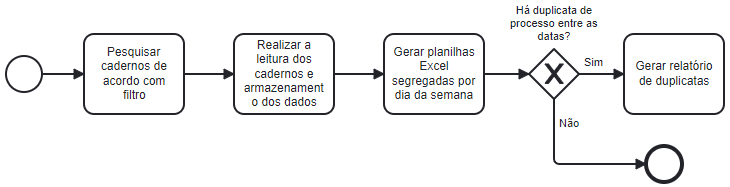

# TST - Cadernos

Projeto de Extração de números de processos de cadernos do TST.


## Tabela de Conteúdo
- [TST - Cadernos](#tst---cadernos)
  - [Tabela de Conteúdo](#tabela-de-conteúdo)
  - [Instalação](#instalação)
  - [Execução](#execução)
  - [_Features_](#features)
  - [Funcionamento do Módulo](#funcionamento-do-módulo)
    - [1. Diretório raiz](#1-diretório-raiz)
    - [2. Diretório app](#2-diretório-app)
    - [3. Diretório resultados](#3-diretório-resultados)
    - [4. Diretório src](#4-diretório-src)
      - [4.1 Subdiretório entidades](#41-subdiretório-entidades)
      - [4.2 Subdiretório use\_cases](#42-subdiretório-use_cases)
      - [4.3 Subdiretório utils](#43-subdiretório-utils)
  - [Outputs](#outputs)
  - [Roadmap](#roadmap)


## Instalação 

Esse módulo possui suas dependências gerenciadas pelo módulo [pipenv](https://pipenv.pypa.io/en/latest/) através dos arquivos Pipfile e Pipfile.lock. 

Para instalar o _pipenv_, é necessário ter o _Python_ já instalado (versão 3.11) e digitar no terminal:

```shell
pip install pipenv
```

Logo após, basta entrar na pasta do projeto e digitar no terminal:

```shell
pipenv install --deploy
```


## Execução

Para a execução, há duas formas de se seguir:

  1. Via código-fonte:

Dentro da raiz do projeto, abrir um terminal e digitar:

```shell
python main.py
```

  2. Via arquivo executável

Na raiz do projeto, há um arquivo executável [LeitorCadernosTST.exe](LeitorCadernosTST.exe) para Windows. Basta executá-lo.


## _Features_

 - Navegação no site do tribunal e _download_ dos cadernos
 - Leitura dos cadernos para extração do número do processo
 - Salvamento dos números de processos em planilhas separadas por data
 - Geração de relatório de duplicatas, caso existente.
 - Arquivo executável Windows.


## Funcionamento do Módulo



Foi aplicada a ideia do código limpo orientada a uma arquitetura inspirada na [Arquitetura Limpa](https://www.amazon.com.br/Clean-Architecture-Craftsmans-Software-Structure/dp/0134494164) proposta por Robert Martin, que visa isolar modelos, regras de negócio e dependências externas à aplicação.

Desta forma, a aplicação é dividida na seguinte árvore de diretórios:

### 1. Diretório raiz

Na raiz do projeto, localizam-se os arquivo de acesso primário do usuário com a aplicação para que seja possível executá-la bem como arquivos referentes ao projeto em si.

Por exemplo, nela constam os arquivos do gerenciador de dependências para o ambiente, os arquivos principais para CLI e executável e as constantes para configuração.

### 2. Diretório [app](app/)

Aqui, ficam as configurações mais técnicas da aplicação como a configuração dos logs (arquivo de constantes também poderia encaixar aqui).

### 3. Diretório [resultados](resultados/)

Nesse diretório são alocados os arquivos de saída da execução de forma local além dos arquivos baixados ao longo do procedimento.

### 4. Diretório [src](src/)

Este é o diretório no qual se concentra todo o código fonte da aplicação e segue uma arquitetura simplificada coerente com a natureza do projeto. Para isso, foi subdividido em mais três subdiretórios, sendo:

#### 4.1 Subdiretório [entidades](src/entidades/)

Aqui devem ficar o núcleo da aplicação com suas características e modelagens principais sem dependência nas demais camadas e suas principais validações.

#### 4.2 Subdiretório [use_cases](src/use_cases/)

Este diretório é considerado o mais crítico da aplicação pois é onde se concentram as regras de negócio e lógicas do projeto.

#### 4.3 Subdiretório [utils](src/utils/)

Finalmente, esse subdiretório costuma ser organizado em classes ou funções orientadas às ferraemntas e dependências, funcionando como uma primeira ponte entre as funcionalidades do núcleo da sua aplicação com dependências de terceiros.

Aqui estão arquivos que centralizam dependências, como exemplo, um arquivo com as funções gerais do módulo _Selenium_ utilizadas, de forma que a manutenção referente a essa biblioteca seja feita em um só lugar. 

## Outputs

Nesse projeto, há dois tipos de saídas esperadas: uma das saídas do projeto são arquivos _Excel_ contendo os números de processos lidos dos cadernos agrupados por data, sem um arquivo por data. 

Já o outro resultado é uma planilha-relatório a ser gerada caso haja alguma duplicata de processo em datas distintas. Nela, são apresentados os números de processo que foram repetidos e as datas em que constam esses processos.


## Roadmap

 - [x] Implementar _log_ de interface com o usuário;
 - [x] Executar módulo no servidor via CLI;
 - [x] Executar módulo no servidor via executável;
 - [x] Estruturar arquitetura limpa;
 - [x] Realizar tratativas de exceções;
 - [ ] Customizar tipos e exceções;
 - [ ] Implementar testes e controle de qualidade (SonarQube);
